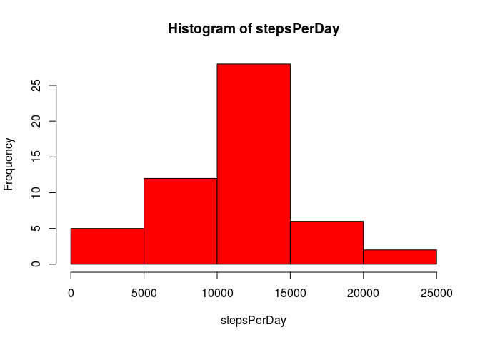
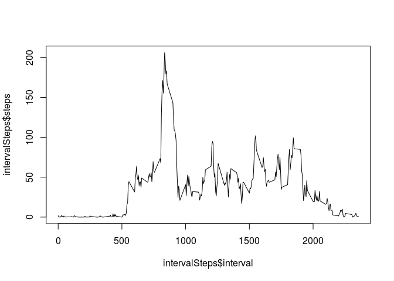
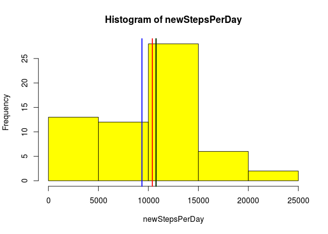
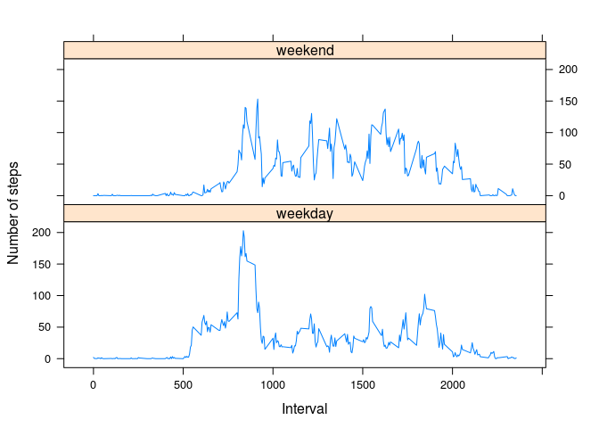

# Reproducible Research: Peer Assessment 1
September 20, 2015  

## Report Description

This report contains information specified for the Peer Assessment 1 project 
in the Coursera Reproducible Research class. Each requirement from the assignment
is marked below and generally consists of a code segment and an accompanying chart
or text snippet in response to the requirement.


## Loading and preprocessing the data

My code immediately below is for reading in the project dataset and processing the 
data. This code admittedly goes way beyond answering the simple requirement of loading 
the data. I've experimented with code to check for the existence of the "csv" file to
be loaded and if absent respond by extracting from a local "zip" file or if necessary
retrieving the original data from the given URL. It is not production-ready as the
URL and filenames are hard-coded rather than passed to the function as would be more
appropriate. The extended work was included so that I might use this code elsewhere.
In any case, it fully performs the function needed for the assignment.


```r
# Loading and preprocessing the data
#
# Functions included:
#   downloadRawData()
#   loadData()

downloadRawData <- function(url, destfile){
        # Retrieves a file from Internet. Stores file in location specified
        # in destfile or defaults to current directory with same name as
        # in passed url if no destfile is given.
        #
        # Args:
        #       data_source: a dataframe containing URL & file information
        #
        # Returns:
        #       none
        
        
        if(missing(destfile)){ # destination was not passed in
                destfile <- basename(URLdecode(url))
        }

        # Get the file
        library(curl)
        download.file(url, destfile, method = "curl", quiet = TRUE)
        
        if(!file.exists(destfile)){ # Error if file didn't download
                stop(paste("Failed to download source file from :",url))
        }
}

loadData <- function(){
        # Loads the household power consumption data into memory. Since the days of
        # interest is the same for all plots, this function will also subset the data
        # to the days of interest.
        # 
        # Args:
        #   empty
        
        # Setup temporarily hard-coded parameters:
        source_url  <- "https://d396qusza40orc.cloudfront.net/repdata%2Fdata%2Factivity.zip"
        zip_fname   <- "activity.zip"
        csv_fname   <- "activity.csv"
        data_source <- data.frame(csv_fname, zip_fname, source_url, stringsAsFactors = FALSE)
        rm(source_url, zip_fname, csv_fname)
        #
        # Returns:
        #   A dataframe with the subset of interest of the household power
        #   consumption data.

        # Store data in subdirectory
        data_dir <- file.path(getwd(),"data")
        csv_file <- file.path(data_dir,data_source$csv_fname)
        
        if(!file.exists(csv_file)){ # Didn't find data file
                
                zip_file <- file.path(data_dir,data_source$zip_fname)
                if(!file.exists(zip_file)){ # Didn't find compressed data
                        
                        data_path <- file.path(data_dir)
                        if(!file.exists(data_path)){ # No data subdir found
                                dir.create(data_path)
                                # Add code here to Die on error!
                        }
                        # Download raw zip file
                        downloadRawData(data_source$source_url, zip_file)
                }
                # Extract Data file
                unzip(zip_file, files = data_source$csv_fname, exdir = data_dir)
        }
        myData <- read.csv(csv_file, na.strings = "NA", 
                           colClasses = c("numeric","Date","numeric"))

        myData # Return loaded dataframe.
}

# Call function to load raw data.
myData <- loadData()
```


## What is mean total number of steps taken per day?
This code block produces a total number of steps per day histogram:

```r
# 1.Calculate the total number of steps taken per day ignoring missing values
stepsPerDay <- aggregate(.~date, data=myData, sum, na.rm = TRUE)$steps

# 2. Make a histogram of the total number of steps taken each day
hist(stepsPerDay, col = "red")
```

 

Now to report both the mean and median number of steps taken each day:  


```r
# 3. Report the mean and median of the total number of steps 
#    taken per day
meanDailySteps <- mean(stepsPerDay)
medianDailySteps <- median(stepsPerDay)
```

Mean steps per day: 1.0766189\times 10^{4}

Median steps per day: 1.0765\times 10^{4}  

## What is the average daily activity pattern?

A block of code follows producing the time series plot of the average number
of steps taken (averaged across all days) versus the 5-minute intervals.


```r
# Average number of steps taken per interval across all days (y-axis)
intervalSteps <- aggregate(.~interval, data=myData, mean)

# Generate the time series plot interval vs avg steps
plot(intervalSteps$interval,intervalSteps$steps, type="l")
```

 

Now to report give the 5-minute interval that, on average, contains the 
maximum number of steps the following code produces the value output below:


```r
# Find 5-minute interval with maximum average steps across all the days in the dataset
maxInterval <- intervalSteps[intervalSteps$steps == max(intervalSteps$steps),"interval"]
```

Interval containing max average steps: 835

## Imputing missing values

There are a number of days/intervals where there are missing 
values (coded as NA). The presence of missing days may introduce bias into 
some calculations or summaries of the data.


```r
# Calculate the total number of missing values in the dataset
missingCount <- sum(colSums( is.na(myData)))
```

There are 2304 missing values in this dataset.

Describe and show with code a strategy for imputing missing data -- A 
completely trivial strategy of computing and substituting the median of all 
non-missing values in place of the missing values for the steps count is 
employed.

The following code implements the missing data replacement strategy:


```r
# Create a new dataset that is equal to the original dataset but with the 
# missing data filled in.
newData <- myData
newData[is.na(newData$steps),"steps"]= median(newData$steps, na.rm = TRUE)
```


Next is code to generate the histogram of the total number of steps taken each 
day after missing values were imputed.


```r
# 
# Make a histogram of the total number of steps taken each day after imputation.
newStepsPerDay <- aggregate(.~date, data=newData, sum)$steps
hist(newStepsPerDay, col = "yellow")

newMeanDailySteps <- mean(newStepsPerDay)
newMedianDailySteps <- median(newStepsPerDay)
abline(v = newMeanDailySteps, col = "blue", lwd = 2)
abline(v = meanDailySteps, col = "green", lwd = 2)
abline(v = newMedianDailySteps, col = "red", lwd = 2)
abline(v = medianDailySteps, col = "black", lwd = 2)
```

 

The Mean with imputed data (9354.2295082) is marked above in blue.

The Mean without imputed data (1.0766189\times 10^{4}) is marked above in green.

The Median with imputed data (1.0395\times 10^{4}) is marked above in red.

The Median without imputed data (1.0765\times 10^{4}) is marked above in black.

(Note: The black and green lines overlap.)

## Are there differences in activity patterns between weekdays and weekends?

A panel plot comparing the average number of steps taken per 5-minute interval 
across weekdays and weekends is generated as follows:


```r
# Create a new factor variable in the dataset with two levels -- "weekday" and 
# "weekend" indicating whether a given date is a weekday or weekend day.
newData$dayType <- as.factor( 
        ifelse(weekdays(newData$date, abbreviate = TRUE) 
               %in% c("Sat","Sun"),"weekend","weekday")
)

# Make a panel plot containing a time series plot (i.e. type = "l") of the 
# 5-minute interval (x-axis) and the average number of steps taken, averaged 
# across all weekday days or weekend days (y-axis).
dayTypeAnalysis <- aggregate(cbind(steps) ~ interval+dayType, data = newData,mean)
library(lattice)
xyplot(steps ~ interval | dayType, 
                     data = dayTypeAnalysis,
                     type = "l",
                     xlab = "Interval",
                     ylab = "Number of steps",
                     layout=c(1,2))
```

 
